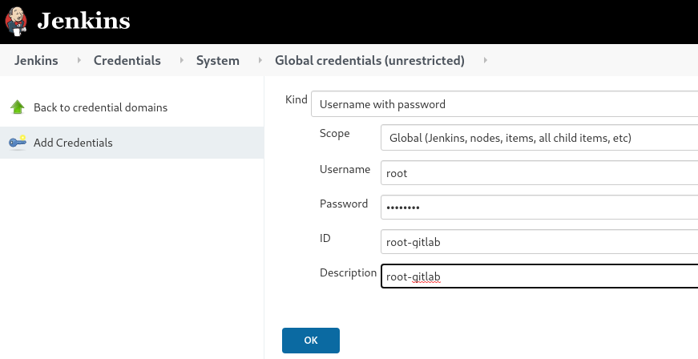
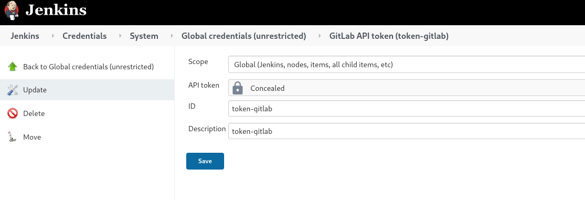
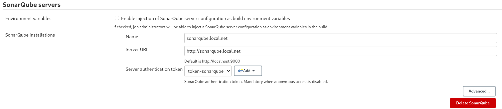
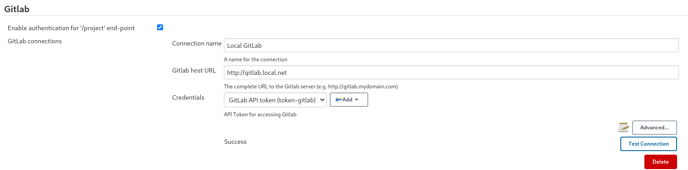
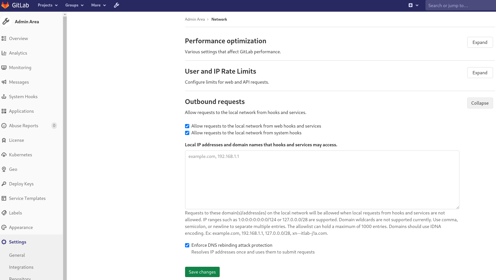
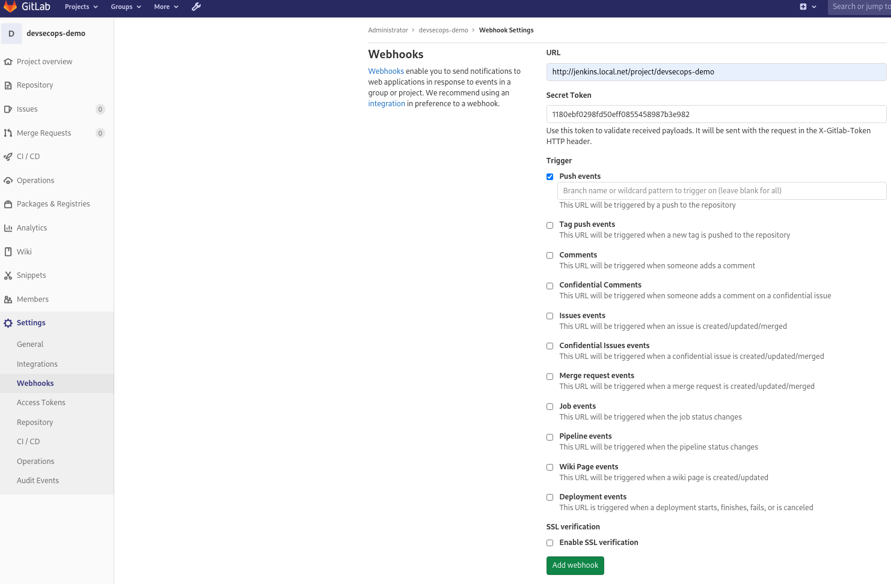
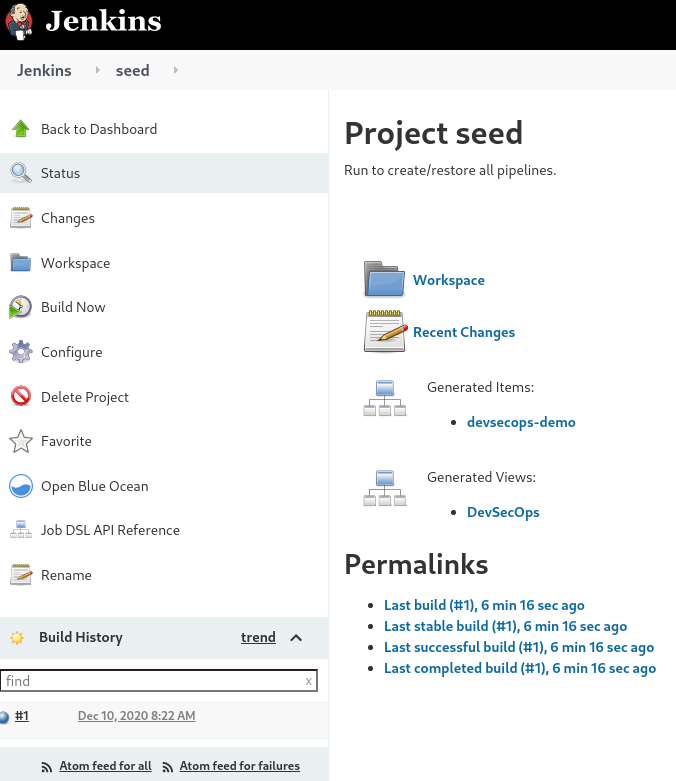
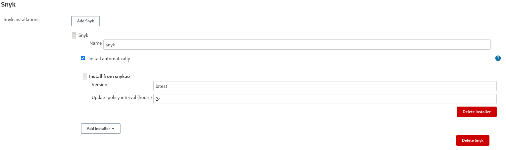
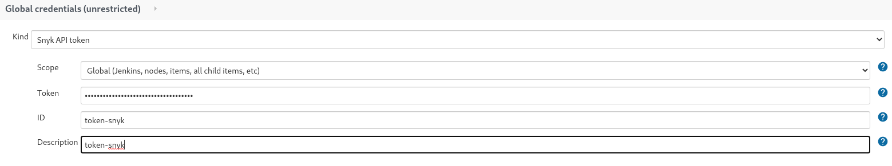
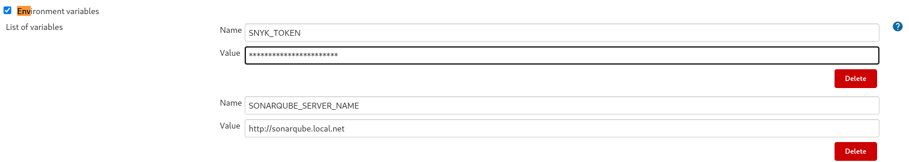

# Getting Setup To Run The Demo

* Add snyk to setup markdown.

This repository implements a demo of DevSecOps tools against some sample code bases. The goal being to evaluate these tools against each other useing the same baseline and also provide examples of usage. 

It, presently, contains the following applications to support the demo. 

* Gitlab(13.5.3-ee)
* Jenkins(2.249.3)
* SonarQube(8.4.2 Community Edition)

As much as possible, we have bootstrapped the application stack to work together. But some **manual** configuration **is** needed once the stack is running. Please see the Quick Start section for details. 

The repository includes some open source license code to use for the demo and evaluating different DevSecOps tools. See the sample_projects directory. 

## Pre-requisites
* Bash: For the bootstrap.sh script. Otherwise you can do manually.
* Curl: For the bootstrap.sh script. Otherwise you can do manually.
* Docker
* Docker Compose
* Network connection so it can reach Docker Hub.

A *reasonably* spec'd computer. GitLab is especially heavy to run and takes several minutes to get *healthy* on my laptop which is running Fedora and has 16GB memory and a quad core processor with 8 threads. 

If running Docker Desktop on Windows or Mac you will probably need to **tune the settings** regarding memory for the VM to prevent swapping.

Add the following to `hosts` file on the computerrunning docker. 

```
# Local stuff
127.0.0.1	traefik.local.net
127.0.0.1	sonarqube.local.net
127.0.0.1	jenkins.local.net
127.0.0.1	gitlab.local.net
```

**NOTE:** Gitlab and SonarQube use Elasticsearch.

Elasticsearch uses a mmapfs directory by default to store its indices. The default operating system limits on mmap counts is likely to be too low, which may result in out of memory exceptions.

On Linux, you can increase the limits by running the following command as `root`

```
sysctl -w vm.max_map_count=262144
``` 

To set this value permanently, update the vm.max_map_count setting in /etc/sysctl.conf. To verify after rebooting, run sysctl vm.max_map_count.

## Initial Setup

From the root of the repository.

* `docker-compose build`
* `./bootstrap.sh`

Now you need to wait for the stack to come up.
```
Creating network "devsecops-demos_default" with the default driver
Creating volume "devsecops-demos_jenkins_data" with default driver
Creating volume "devsecops-demos_sonar_data" with default driver
Creating volume "devsecops-demos_sonar_logs" with default driver
Creating volume "devsecops-demos_sonar_db_volume" with default driver
Creating volume "devsecops-demos_gitlab_config" with default driver
Creating volume "devsecops-demos_gitlab_logs" with default driver
Creating volume "devsecops-demos_gitlab_data" with default driver
Creating gitlab       ... done
Creating jenkins      ... done
Creating traefik      ... done
Creating pg_sonarqube ... done
Creating sonarqube    ... done
Waiting for gitlab to be healthy. Be patient, may take a few minutes.
```

Once gitlab is healthy the `bootstrap.sh` script pushes **this** repository to gitlab http://gitlab.local.net/root/devsecops-demo. 

Unfortunately we cannot fully bootstrap the tools so they integrate together. In order to do this we need to create some tokens and credentials, which we cannot do until the applications are running. A chicken/egg scenario...

The following steps marked **REQUIRED** must be done **in this order** after the **first** run of the demo with the `bootstrap.sh` script. Remember to take a copy of all the tokens you create. The steps marked **OPTIONAL** are to get webhooks from Gitlab working. But this is not strictly needed as the pipelines can be ran fromJenkins.

1. Create Username and Password credential for cloning. (**REQUIRED**)

    In Jenkins create a credential of type `Username with Password` with the name `root-gitlab`. Note that it **must be** named `root-gitlab`.

    

2. Create the token `token-sonarqube`. (**REQUIRED**)

    The bootstrap.sh script created a token for the jenkins user in SonarQube. You can use this or create one manually yourself.

    

    **Copy** the token and create a credential of type `secret text` in Jenkins called `token-sonarqube`.

    

3. Create the token `token-gitlab`. (**REQUIRED**)

    After logging in to gitlab. Go to admin users `Profile->Settings->Access Tokens`.

    

    **Copy** the token and create a credential of type `GitLab API Token` in Jenkins called `token-gitlab`.

    

4. Configure SonarQube and Gitlab Connections.

    Go to `Manage Jenkins->Configure System->SonarQube servers` and use the newly created token.

    

    Go to Manage `Jenkins->Configure System->Gitlab`, use the newly created token and test the connection.

    

5. Allow WebHooks on local network for GitLab. (**OPTIONAL**)

    Go to `Global settings->Network->Outbound Requests`(The small wrench on top menu) and make sure the settings correspond to the image below.

    

6. Create a WebHook From Gitlab To Jenkins demo Pipeline(s). (**REQUIRED**)

    First you need to create a credential in **Jenkins** for the Jenkins user by going to the Jenkins users `Profile->Configure` and creating one. Make sure to **copy** it.

    

    Next go to the DevSecOps-Demo repository in Gitlab and select `Settings->WebHooks`. Create the WebHook using the Jenkins user token you just created.

    

7. Run the Seed Job. (**REQUIRED**)

    This will generate the **pipeline** job(s) which can then be ran for demo purposes.

    

8. Create a Snyk Installation and needed tokens. (**REQUIRED**)

    You need to create a **free** account on [Snyk](https://app.snyk.io/). See the [plans](https://snyk.io/plans/) for more info.

    Go to `Manage Jenkins -> Global Tool Configuration` and add a Snyk installation.

    

    Create credential of type Snyk API Token. You can find your individual token under your profile ingeneral settings on [Snyk](https://app.snyk.io/)

    

    The Jenkins Snyk plugin does not seem to support Container scanning. So only option is the CLI. For this to work we need to create an environment variable with the token. Go to `Manage Jenkins -> Configuration System` to do this. Note that it **must** be SNYK_TOKEN.

    


From now on you can take the stack up and down with docker-compose commands.

* `docker-compose up -d` to bring it up.
* `docker-compose down` to bring it down.

## Good To Know

* http://traefik.local.net : Proxies all the applications. The Dashboard is not secured. 
* http://jenkins.local.net : Jenkins CI server. User is `jenkins` and password is `password`.
* http://gitlab.local.net : VCS repo manager. User is `root` and password is `passsword`.
* http://sonarqube.local.net : Static analysis tool. A Jenkins user is also created with the same credentials as for Jenkins itself, i.e. user is `jenkins` and password is `password`. The default user `admin` is also available with password `admin`.
* If you need to start fresh just bring the stack down with `docker-compose down -v`. This will **destroy** the docker volumes. You will need to do the **Initial Setup** again.